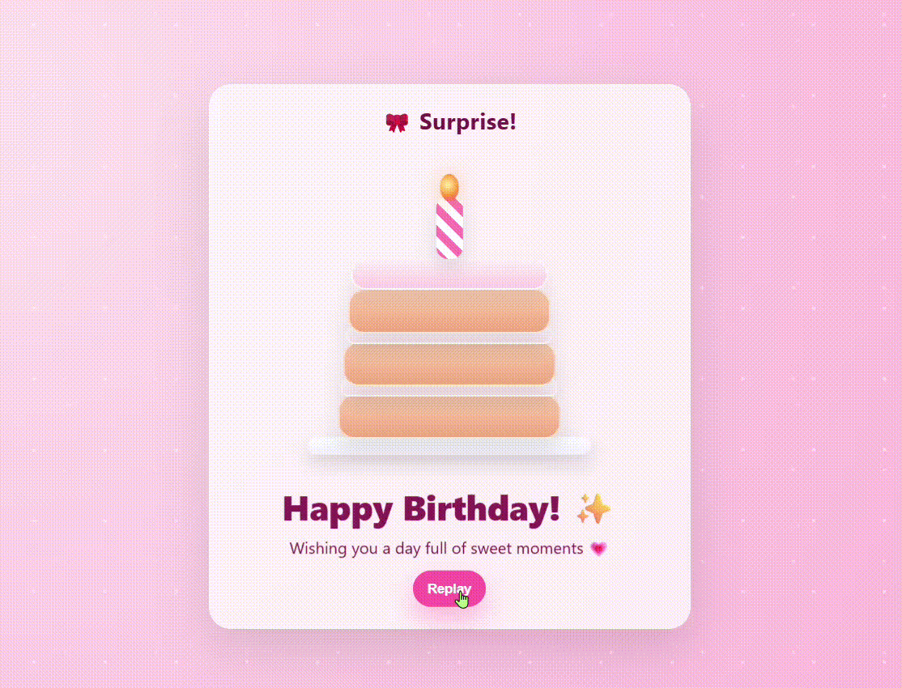

# Birthday-Cake

This project is an interactive birthday celebration webpage built with HTML, CSS, and JavaScript.

When the page loads, cake layers fall into place, a candle lights up, and a birthday message appears. The animation can be replayed using a button.

## Features
- Cake-building animation
- Candle flame effect
- Animated birthday message
- Replay button for the animation

## Technologies Used
- HTML
- CSS
- JavaScript

## How to Run
1. Download the project
2. Open `index.html` in your browser

## Preview

